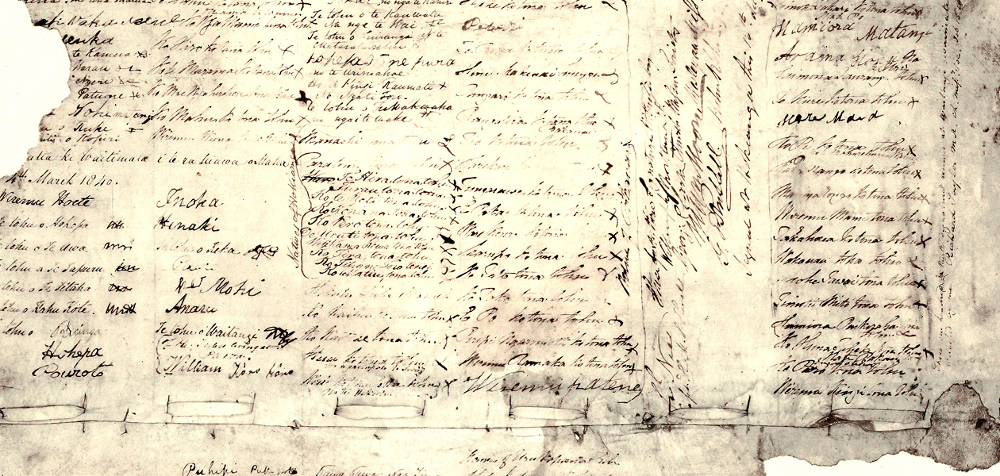

First, the Te reo Māori version, then the English, and then the translated Te Reo into English versions of the Treaty.

---

# Text of the Treaty of Waitangi

Ko Wikitoria, te Kuini o Ingarani, i tana mahara atawai ki nga Rangatira me nga Hapu o Nu Tirani i tana hiahia hoki kia tohungia ki a ratou o ratou rangatiratanga, me to ratou wenua, a kia mau tonu hoki te Rongo ki a ratou me te Atanoho hoki kua wakaaro ia he mea tika kia tukua mai tetahi Rangatira hei kai wakarite ki nga Tangata maori o Nu Tirani-kia wakaaetia e nga Rangatira maori te Kawanatanga o te Kuini ki nga wahikatoa o te Wenua nei me nga Motu-na te mea hoki he tokomaha ke nga tangata o tona Iwi Kua noho ki tenei wenua, a e haere mai nei.

Na ko te Kuini e hiahia ana kia wakaritea te Kawanatanga kia kaua ai nga kino e puta mai ki te tangata Maori ki te Pakeha e noho ture kore ana.

Na, kua pai te Kuini kia tukua a hau a Wiremu Hopihona he Kapitana i te Roiara Nawi hei Kawana mo nga wahi katoa o Nu Tirani e tukua aianei, amua atu ki te Kuini e mea atu ana ia ki nga Rangatira o te wakaminenga o nga hapu o Nu Tirani me era Rangatira atu enei ture ka korerotia nei.

Ko te Tuatahi

Ko nga Rangatira o te Wakaminenga me nga Rangatira katoa hoki ki hai i uru ki taua wakaminenga ka tuku rawa atu ki te Kuini o Ingarani ake tonu atu-te Kawanatanga katoa o o ratou wenua.

Ko te Tuarua

Ko te Kuini o Ingarani ka wakarite ka wakaae ki nga Rangatira ki nga hapu-ki nga tangata katoa o Nu Tirani te tino rangatiratanga o o ratou wenua o ratou kainga me o ratou taonga katoa. Otiia ko nga Rangatira o te Wakaminenga me nga Rangatira katoa atu ka tuku ki te Kuini te hokonga o era wahi wenua e pai ai te tangata nona te Wenua-ki te ritenga o te utu e wakaritea ai e ratou ko te kai hoko e meatia nei e te Kuini hei kai hoko mona.

Ko te Tuatoru

Hei wakaritenga mai hoki tenei mo te wakaaetanga ki te Kawanatanga o te Kuini-Ka tiakina e te Kuini o Ingarani nga tangata maori katoa o Nu Tirani ka tukua ki a ratou nga tikanga katoa rite tahi ki ana mea ki nga tangata o Ingarani.

(Signed) William Hobson,
Consul and Lieutenant-Governor.

Na ko matou ko nga Rangatira o te Wakaminenga o nga hapu o Nu Tirani ka huihui nei ki Waitangi ko matou hoki ko nga Rangatira o Nu Tirani ka kite nei i te ritenga o enei kupu, ka tangohia ka wakaaetia katoatia e matou, koia ka tohungia ai o matou ingoa o matou tohu.

Ka meatia tenei ki Waitangi i te ono o nga ra o Pepueri i te tau kotahi mano, e waru rau e wa te kau o to tatou Ariki.

Ko nga Rangatira o te wakaminenga.

---

Preamble

HER MAJESTY VICTORIA Queen of the United Kingdom of Great Britain and Ireland regarding with Her Royal Favour the Native Chiefs and Tribes of New Zealand and anxious to protect their just Rights and Property and to secure to them the enjoyment of Peace and Good Order has deemed it necessary in consequence of the great number of Her Majesty's Subjects who have already settled in New Zealand and the rapid extension of Emigration both from Europe and Australia which is still in progress to constitute and appoint a functionary properly authorized to treat with the Aborigines of New Zealand for the recognition of Her Majesty's Sovereign authority over the whole or any part of those islands – Her Majesty therefore being desirous to establish a settled form of Civil Government with a view to avert the evil consequences which must result from the absence of the necessary Laws and Institutions alike to the native population and to Her subjects has been graciously pleased to empower and to authorize me William Hobson a Captain in Her Majesty's Royal Navy Consul and Lieutenant Governor of such parts of New Zealand as may be or hereafter shall be ceded to her Majesty to invite the confederated and independent Chiefs of New Zealand to concur in the following Articles and Conditions.

Article the First

The Chiefs of the Confederation of the United Tribes of New Zealand and the separate and independent Chiefs who have not become members of the Confederation cede to Her Majesty the Queen of England absolutely and without reservation all the rights and powers of Sovereignty which the said Confederation or Individual Chiefs respectively exercise or possess, or may be supposed to exercise or to possess over their respective Territories as the sole Sovereigns thereof.

Article the Second

Her Majesty the Queen of England confirms and guarantees to the Chiefs and Tribes of New Zealand and to the respective families and individuals thereof the full exclusive and undisturbed possession of their Lands and Estates Forests Fisheries and other properties which they may collectively or individually possess so long as it is their wish and desire to retain the same in their possession; but the Chiefs of the United Tribes and the individual Chiefs yield to Her Majesty the exclusive right of Preemption over such lands as the proprietors thereof may be disposed to alienate at such prices as may be agreed upon between the respective Proprietors and persons appointed by Her Majesty to treat with them in that behalf.

Article the Third

In consideration thereof Her Majesty the Queen of England extends to the Natives of New Zealand Her royal protection and imparts to them all the Rights and Privileges of British Subjects.

W HOBSON
Lieutenant Governor.

Now therefore We the Chiefs of the Confederation of the United Tribes of New Zealand being assembled in Congress at Victoria in Waitangi and We the Separate and Independent Chiefs of New Zealand claiming authority over the Tribes and Territories which are specified after our respective names, having been made fully to understand the Provisions of the foregoing Treaty, accept and enter into the same in the full spirit and meaning thereof: in witness of which we have attached our signatures or marks at the places and the dates respectively specified.

Done at Waitangi this Sixth day of February in the year of Our Lord One thousand eight hundred and forty.

[Here follow signatures, dates, etc.]

---

Victoria, the Queen of England, in her concern to protect the chiefs and the subtribes of New Zealand and in her desire to preserve their chieftainship1 and their lands to them and to maintain peace2 and good order considers it just to appoint an administrator3 one who will negotiate with the people of New Zealand to the end that their chiefs will agree to the Queen's Government being established over all parts of this land and (adjoining) islands4 and also because there are many of her subjects already living on this land and others yet to come. So the Queen desires to establish a government so that no evil will come to Māori and European living in a state of lawlessness. So the Queen has appointed 'me, William Hobson a Captain' in the Royal Navy to be Governor for all parts of New Zealand (both those) shortly to be received by the Queen and (those) to be received hereafter and presents5 to the chiefs of the Confederation chiefs of the subtribes of New Zealand and other chiefs these laws set out here.

The first

The Chiefs of the Confederation and all the Chiefs who have not joined that Confederation give absolutely to the Queen of England for ever the complete government6 over their land.

The second

The Queen of England agrees to protect the chiefs, the subtribes and all the people of New Zealand in the unqualified exercise7 of their chieftainship over their lands, villages and all their treasures.8 But on the other hand the Chiefs of the Confederation and all the Chiefs will sell9 land to the Queen at a price agreed to by the person owning it and by the person buying it (the latter being) appointed by the Queen as her purchase agent.

The third

For this agreed arrangement therefore concerning the Government of the Queen, the Queen of England will protect all the ordinary people of New Zealand and will give them the same rights and duties10 of citizenship as the people of England.11

[signed] William Hobson Consul & Lieut Governor

So we, the Chiefs of the Confederation of the subtribes of New Zealand meeting here at Waitangi having seen the shape of these words which we accept and agree to record our names and our marks thus.

Was done at Waitangi on the sixth of February in the year of our Lord 1840.

 
Footnotes
'Chieftainship': this concept has to be understood in the context of Māori social and political organisation as at 1840. The accepted approximation today is 'trusteeship'.
'Peace': Māori 'Rongo', seemingly a missionary usage (rongo — to hear: ie, hear the 'Word' — the 'message' of peace and goodwill, etc).
Literally 'Chief' ('Rangatira') here is of course ambiguous. Clearly, a European could not be a Māori, but the word could well have implied a trustee-like role rather than that of a mere 'functionary'. Māori speeches at Waitangi in 1840 refer to Hobson being or becoming a 'father' for the Māori people. Certainly this attitude has been held towards the person of the Crown down to the present day — hence the continued expectations and commitments entailed in the Treaty.
'Islands': ie, coastal, not of the Pacific.
Literally 'making': ie, 'offering' or 'saying' — but not 'inviting to concur'.
'Government': 'kawanatanga'. There could be no possibility of the Māori signatories having any understanding of government in the sense of 'sovereignty': ie, any understanding on the basis of experience or cultural precedent.
'Unqualified exercise' of the chieftainship — would emphasise to a chief the Queen's intention to give them complete control according to their customs. 'Tino' has the connotation of 'quintessential'.
'Treasures': 'taonga'. As submissions to the Waitangi Tribunal concerning the Māori language have made clear, 'taonga' refers to all dimensions of a tribal group's estate, material and non-material — heirlooms and wahi tapu (sacred places), ancestral lore and whakapapa (genealogies), etc.
Māori 'hokonga', literally 'sale and purchase'. 'Hoko' means to buy or sell.
'Rights and duties': Māori at Waitangi in 1840 refer to Hobson being or becoming a 'father' for the Māori people. Certainly, this attitude has been held towards the person of the Crown down to the present day — hence the continued expectations and commitments entailed in the Treaty.
There is, however, a more profound problem about 'tikanga'. There is a real sense here of the Queen 'protecting' (ie, allowing the preservation of) the Māori people's tikanga (ie, customs) since no Māori could have had any understanding whatever of British tikanga (ie, rights and duties of British subjects). This, then, reinforces the guarantees in article 2.